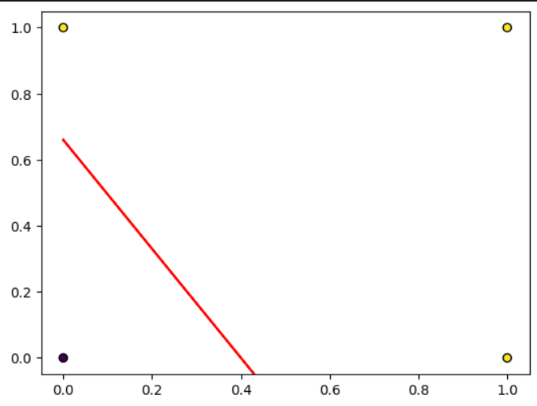

## Perceptron para definir portas lógicas ##
    O perceptron é um algoritmo que tenta simular o funcionamento de um neurônio, ou seja,
    é um modelo proposto por McCulloch e W.Pitts, é uma aproximação do fenômeno ou objeto
    real. No modelo temos:

1 - Temos as entradas: $x_1,x_2,...,x_n$ na qual representam a árvore dendrítica do neurônio.

2 - Temos os pesos das entradas dendríticas:$w_1,w_2,...,w_n$ onde o papel é modular o 
fluxo de sinais passando por certo dendrito.

3 - Para o modelo do corpo celular temos:$u = w_1*x_1+w_2*x_2+...+w_n*x_n - \theta$,
no caso do $\theta$ temos $w_0*x_0$, onde $x_0=-1$ e $w_0=\theta$ e $u$ é a ativação
do corpo.

4 - Para o axônio, é modelo como uma chave ON-OFF indicando se o modelo respondeu ao estimulo
ou não: $y = sinal(u) = \pm1$ , indicando ativado para 1 e sem estímulo para 0.

## Do problema ##
    Com o perceptron simples é possível definir portas lógicas and,or,not. Porém, não con-
    segue solucionar problemas não-linearmente separáveis como portas XOR, por exemplo.

## Da solução ## 
    Os pontos amarelos são as respectivas entradas que indicam TRUE e os pontos azuis
    FALSE, a reta em vermelho separa os pontos demonstrando que pode ser útil para casos de
    classificação entre 2 coisas.

